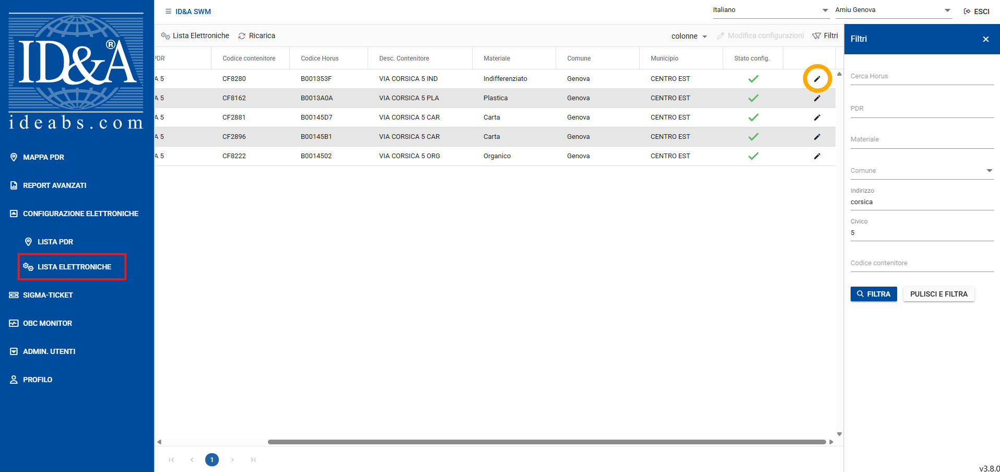

..
    this is a title

Istruzioni
==================

Questa mappa web consente di inviare in modo automatico ad Assistenza Territorio una richiesta di estrazione di utenze in caso di installazione di un nuovo ecopunto.
Per inoltrare la richiesta è necessario seguire le istruzioni che seguono.

.. note:: Per utilizzare questo strumento è necessario fare il login con le credenziali del computer (esempio --> user: Marzocchi password:*inserire la propria password*)

..
    this is a section

DISEGNA AREA
------------------------------------------

1. per prima cosa è ncessario disegnare l'area, per la quale estrarre le utenze, tramite lo strumento di disegno online (riquadro rosso nell'immagine sotto).
Per qggiungere un'area bisogna cliccare sul tasto **Aggiungi** evidenziato in giallo nell'immagine sotto.

.. image:: img/tool.png
    :align: center

|

Cliccare sulla mappa con il tasto sinistro del mouse per disegnare l'area, ad ogni click del mouse verrà aggiunto un vertice. Con il doppio click del mouse verrà terminato il disegno.
Una volta terminato il disegno l'area diventa blu con i vertici indicati da un cerchio arancione (si veda immagine sotto).  E' ovviamente possibile modificare l'area appena disegnata cliccando con il tasto sinistro del mouse su un vertice (o su un punto medio del segmento) e tenedno premuto trascinare il vertice nella posizione desiderata.

.. warning:: NON è possibile cancellare un'area! Qualora fosse necessario, contattare Assistenza Territorio.

.. image:: img/end_area.png
    :align: center

|

COMPILA INFORMAZIONI
------------------------------------------

2. terminato il disegno dell'area è necessario aggiungere un nome che identifichi l'ecopunto, come l'indirizzo (vedi immagine sotto). L'utente viene compilato automaticamente e non può essere modificato.

Se l'area disegnata e il nome inserito sono definitivi, è possible cliccare sulla casella **Invia richiesta ad ASS Territorio**. In questo modo, una volta salvata l'area, verrà inviata una mail con la richiesta.
Se invece l'area non è ancora definitiva, è possibile salvare l'area senza inviare la richiesta e modificarla successivamente.

.. image:: img/info.png
    :align: center

|

SALVATAGGIO
------------------------------------------

3. per salvare l'area e le relative informazioni (nome, utente ed eventuale invio) è necessario cliccare su **Salva** (tasto evidenziato in giallo nell'immagine sotto)

.. image:: img/salva.png
    :align: center

|

.. note:: Si ricorda che se è stata spuntata la casella **Invia richiesta ad ASS Territorio**, la richiesta verrà automaticamente inviata.

.. warning:: Una volta inviata la richiesta non è possibile annullarla, in questo caso contattare Assistenza Territorio.

MODIFICHE
------------------------------------------

E' possibile modificare l'area o le informazioni associate (nome ed eventuale invio) anche dopo aver salvato. E' sufficiente cliccare con il tasto sinistro del mouse sull'area che si vuole modificare, premere il tasto evidenziato nell'immagine sotto e si attiverà nuovamente lo strumento di disegno.
In questo modo è possibile modificare sia il disegno che le informazioni come il nome o spuntare la casella **Invia richiesta ad ASS Territorio** qualora non fosse già stata spuntata.

|

BREVE VIDEO ESPLICATIVO
------------------------------------------

.. image:: img/editing.gif
    :align: center

