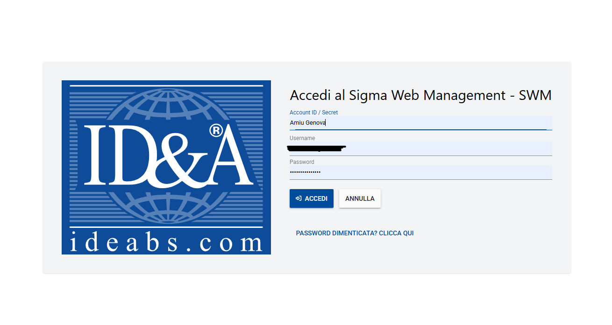
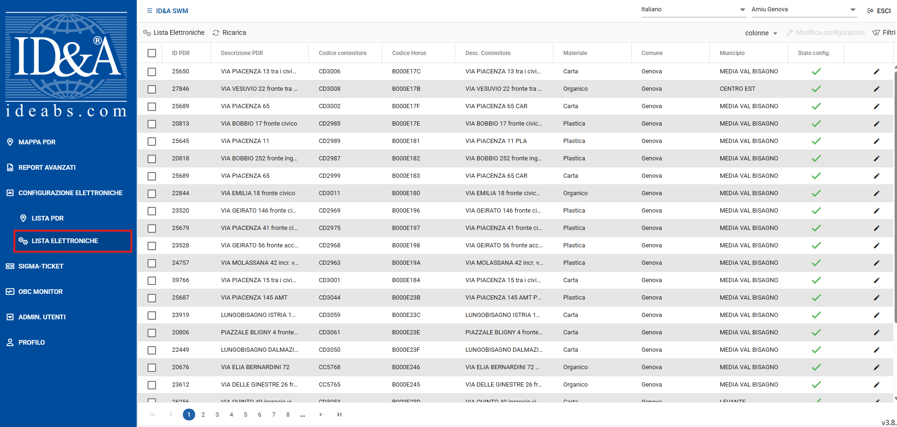
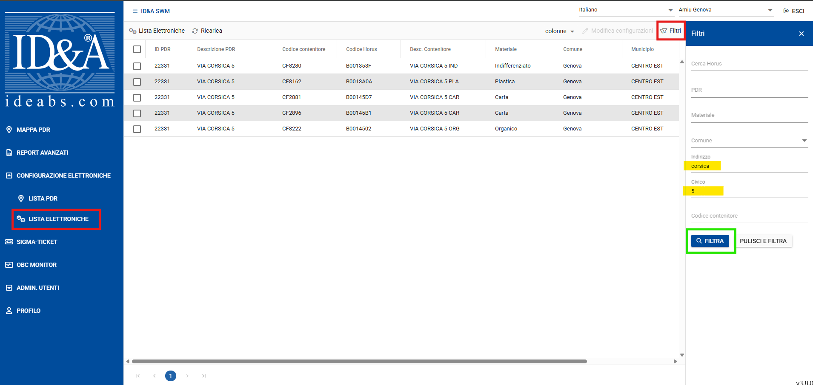
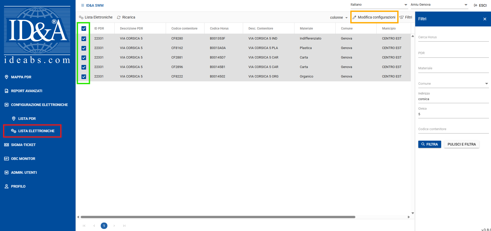
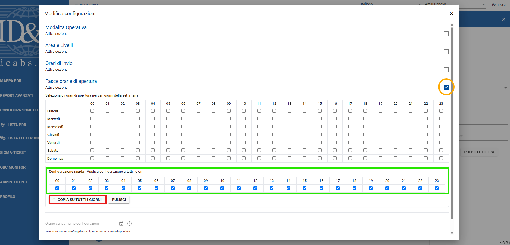
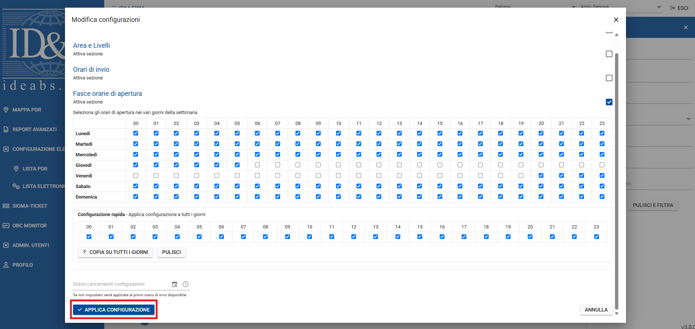
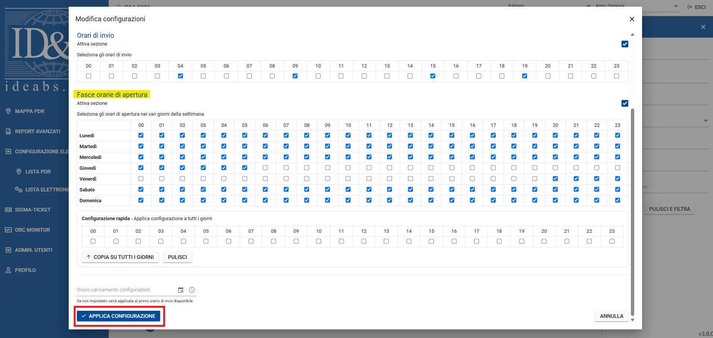

..
    this is a title

Istruzioni
==================

Di seguito viene descritta la procedura per la chiusura dei singoli contenitori con controllo remoto.

Per prima cosa è necessario accedere al portale https://swm.idea-sws.com/ utilizando le proprie credenziali. Nella pagina di Login è richiesto, oltre ad utente e password, anche l'Account ID ovvero **Amiu Genova**

.. note:: Qualora fosse necessario richiedere un nuovo utente o seguire il reset della password, scrivere ad assterritorio@amiu.genova.it

..
    this is a section

LISTA ELETTRONICHE
------------------------------------------

Una volta eseguito l'accesso al portale, andare su **LISTA ELETTRONICHE** dal menù sulla sinistra dello schermo.

|

Qui sono elencati tutti i contenitori attualmente dislocati sul territorio. E' possibile fare filtri per selezionare i contenitori di proprio interesse.

Cliccando sul pulsante **Filtri** (indicato dal rettangolo rosso in alto a destra nella figura di seguito) si apre un pannello sulla destra dello schermo da cui è possibile impostare i filtri, ad esempio per indirizzo. 

Una volta im postati i parametri del filtro, cliccando sul pulsante **Filtra** (indicato dal rettangolo verde nella figura di seguito), verranno elencati solo i contenitori che soddisfano il filtro.

|

MODIFICA CONFIGURAZIONE
------------------------------------------

Ottenuto l'elenco dei contenitori di proprio interesse è possibile modificare la configurazione di tutti i contenitori contemporaneamente o agendo sulla configurazione di ciascun contenitore.

CONFIGURAZIONE MULTIPLA
+++++++++++++++++++++++++++++++++++++++++++

Consente di modificare allo stesso modo la configurazione di tutti i conteniotri selezionati. Per selezionare i contenitori è sufficiente spuntare la casella corrispondente sulla sinistra (indicato dal rettangolo verde nell'immagine di seguito).

Una volta selezionati i contenitori cliccare su **Modifica Configurazioni** (indicato dal rettangolo arancione in altyo a destra nell'immagine di seguito).

|

Cliccando sul pulsante si apre una schermata da cui è necessario abilitare la sezione **Fasce orarie di apertura** cliccando sulla casella corrispondente (indicata dal cerchio arancione nella figura di seguito).

Nella sezione **Configurazione rapida** selezionare tutte le caselle come indicato nel rettangolo verde nell'immagine sotto e cliccare sul bottone **COPIA SU TUTTI I GIORNI** (indicato dal rettangolo rosso nella figura di seguito).

|

Nella sezione **Fasce orarie di apertura** rimuovere la spunta per il giorno e l'orario in cui si vuole chiudere il contenitore. Ad esempio nell'immagine sotto, il contenitore verrebbe chiuso da giovedì alle 6:00 fino a venerdì alle 20:00. Una volta definita la configurazione desiderata, cliccare su **APPLICA CONFIGURAZIONE** (indicato dal rettangolo rosso nella figura di seguito).

|

CONFIGURAZIONE SINGOLA
+++++++++++++++++++++++++++++++++++++++++++

Consente di modificare la configurazione dei singoli contenitori cliccando sul pulsante corrispondente con l'icona della matita (indicato dal cerchio arancione nella figura di seguito)

.. image:: img/modifica.png
    :align: center

|

Cliccando sul pulsante si apre una schermata da cui è possibile modificare la configurazione del relativo contenitore.

Nella sezione **Fasce orarie di apertura** rimuovere la spunta per il giorno e l'orario in cui si vuole chiudere il contenitore. Ad esempio nell'immagine sotto, il contenitore verrebbe chiuso da giovedì alle 6:00 fino a venerdì alle 20:00. Una volta definita la configurazione desiderata, cliccare su **APPLICA CONFIGURAZIONE** (indicato dal rettangolo rosso nella figura di seguito). 

|

..note:: Le configurazioni vengono inviate a determinati orari ovvero alle 4:00, 9:00, 15:00 e 19:00. Quindi se ad esempio si modifica la configurazione alle 11:00, la modifica sarà inviata e quindi attiva a partire dalle 15:00.

.. warning:: ATTENZIONE!!! Ricordarsi, terminato il priodo in cui è necessario chiudere i contenitori, di riaprili tornando sulla stessa schermata e aggiungendo nuovamente la spunta!

